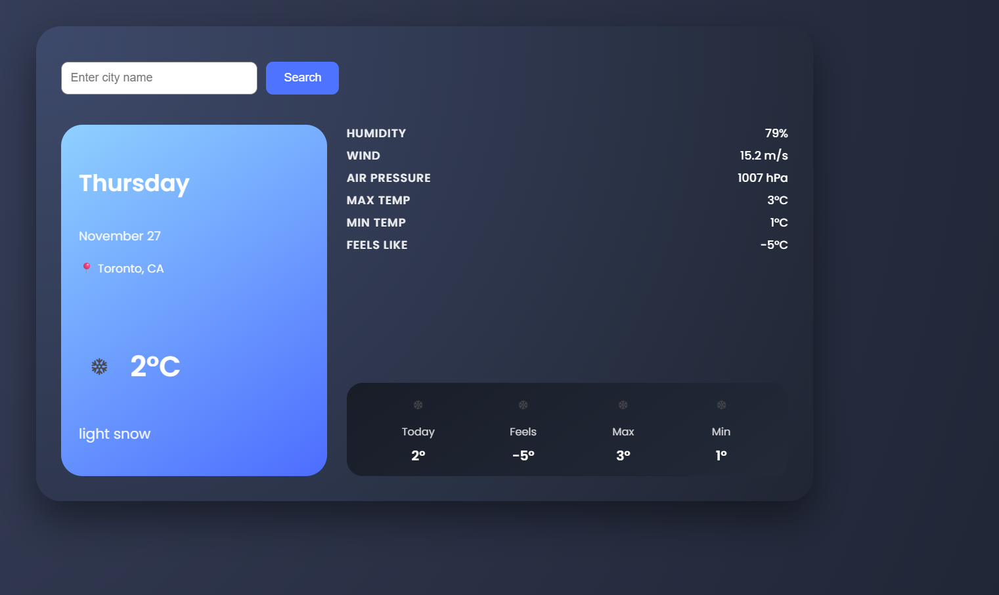
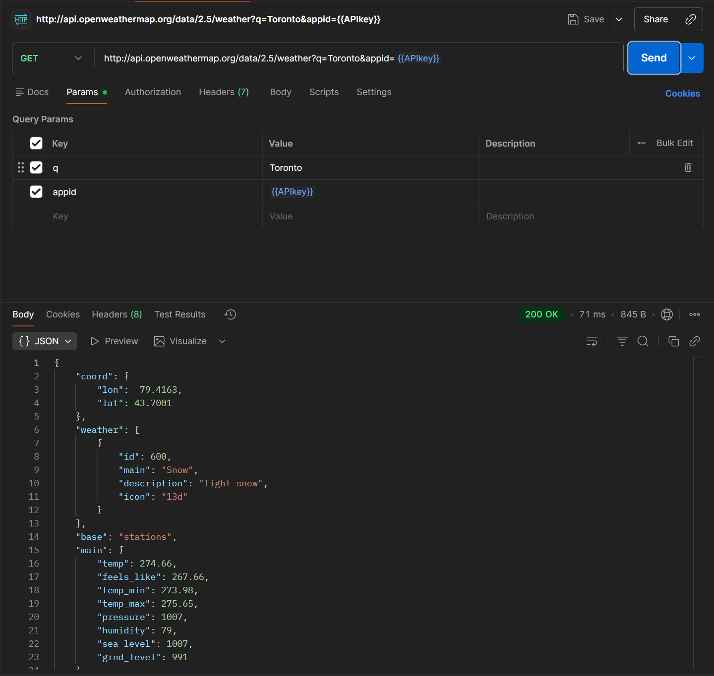

🌤️ Weather App – COMP3123 Lab Test 2

A modern React-based weather application that allows users to search for a city and view its current weather information using the OpenWeather API.
This project implements component-based design, API integration, environment variables, and UI styling.

📦 Installation & Setup
1️⃣ Clone the repository
git clone <https://github.com/rozeluxe01/101505276_comp3123_labtest2>

2️⃣ Install dependencies
npm install

3️⃣ Create your .env file

At the root of the project (same level as package.json):

REACT_APP_WEATHER_API_KEY=your_api_key_here

⚠️ You must restart the server after adding .env.

4️⃣ Start the development server
npm start

The app will run at:

http://localhost:3000

🌐 API Used

This project uses the current weather endpoint from OpenWeather:

https://api.openweathermap.org/data/2.5/weather

Query includes:

q — city

appid — API key

units=metric — Celsius

📸 Screenshots

Example:

Author

Kevin George Buhain

COMP3123 – Lab Test 2

George Brown College